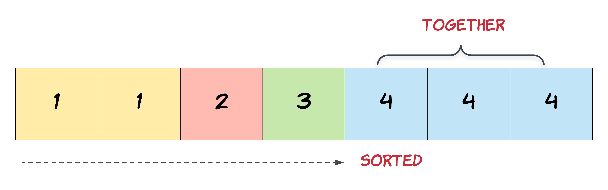

# 26. Remove Duplicates from Sorted Array

## 📝 Problem Statement

Given an integer array `nums` **sorted in non-decreasing order**, remove the duplicates **in-place** such that each unique element appears only once.  
The relative order of the elements should be kept the same.

Return the number of unique elements `k`.

---

### 🧠 Requirements
To get accepted, you must:
1. Modify the array `nums` in-place such that the first `k` elements contain the unique elements.
2. Return `k`.
3. The remaining elements beyond the first `k` can be ignored.

---

### 🔹 Example 1
**Input:**  
`nums = [1,1,2]`

**Output:**  
`2, nums = [1,2,_]`

**Explanation:**  
The function should return `k = 2`, with the first two elements being `[1, 2]`.  
It does not matter what you leave beyond the returned `k`.

---

### 🔹 Example 2
**Input:**  
`nums = [0,0,1,1,1,2,2,3,3,4]`

**Output:**  
`5, nums = [0,1,2,3,4,_,_,_,_,_]`

**Explanation:**  
The function should return `k = 5`, with the first five elements `[0,1,2,3,4]`.  
The remaining elements are ignored.

---

### 🔸 Constraints
- `1 <= nums.length <= 3 * 10^4`  
- `-100 <= nums[i] <= 100`  
- `nums` is sorted in non-decreasing order.

---

### 💡 Topics
- Array  
- Two Pointers  

---

### 💭 Hints
1. Since the array is sorted, duplicates are grouped together.  
2. Use **two pointers** — one for traversing (`j`) and one for tracking the position of the next unique element (`i`).  
3. When a new unique element is found, move it to the next position.

---

### 🖼️ Visual Representation

---

### 🔗 Related Problems
- [LeetCode 80. Remove Duplicates from Sorted Array II](https://leetcode.com/problems/remove-duplicates-from-sorted-array-ii/)
